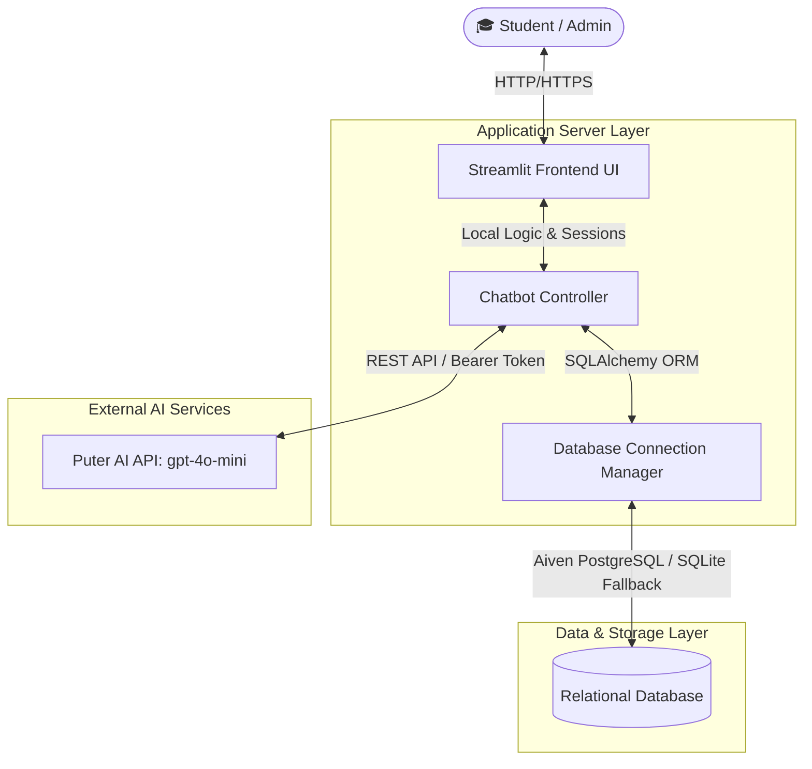
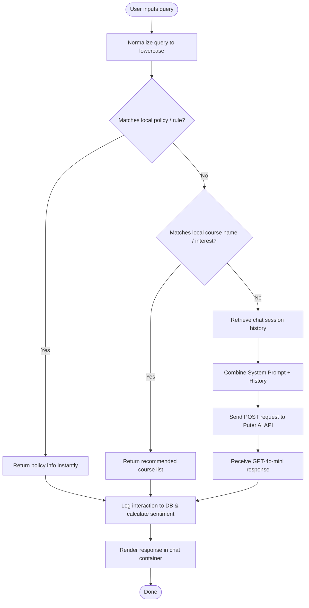
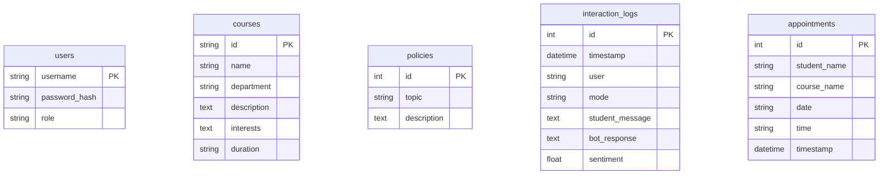
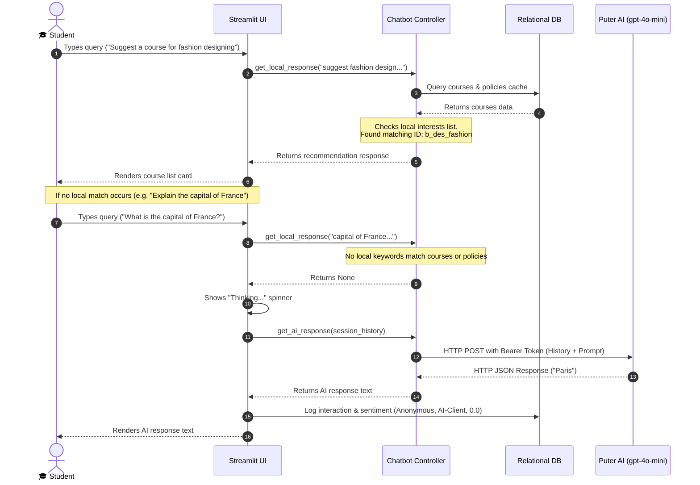

# CU AI Advisor - Chatbot Architecture & API Flow Documentation

This document provides a detailed breakdown of the system architecture, data models, logic routing, and API integration flows for the Chandigarh University AI Advisor application (MCA Final Year Project).

---

## 1. System Architecture Overview

The application is built using a **hybrid serverless-ready architecture** designed for high scalability, rapid response times, and robust relational data management.

---

## 2. Hybrid Query Routing Flowchart

The system prioritizes speed and cost efficiency by executing a fast local rule-based match before delegating complex requests to the advanced Large Language Model.

---

## 3. Database Entity-Relationship (ER) Model

The application utilizes SQLAlchemy ORM to manage user sessions, academic programs, university guidelines, feedback sentiment tracking, and booking schedules.

---

## 4. API & Interaction Sequence Diagram

The diagram below details the sequence of operations from the moment a student types a query until the advisor returns the finalized answer.

---

## 5. Security & Deployment Architecture

- **Token Protection**: Puter AI API credentials (`PUTER_TOKEN`) and database connections (`DATABASE_URL`) are stored securely using **Streamlit Secrets** (never committed to git).
- **Graceful DB Fallbacks**: If the cloud-hosted database (Aiven PostgreSQL) encounters connection timeouts or host resolution failures, the database engine falls back dynamically to a local thread-safe **SQLite** file.
